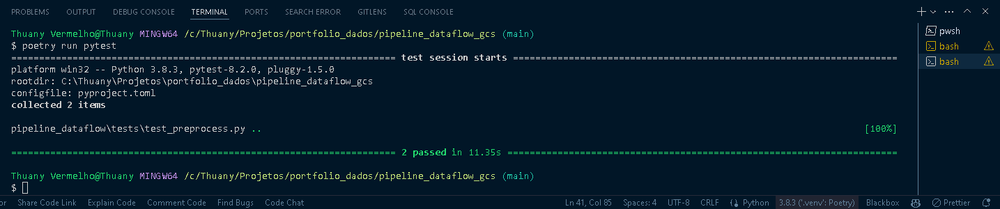

# GCP - Projeto de Engenharia de Dados: ELT dos voos da ANAC, utilizando Storage, Apache Beam no Dataflow, BigQuery e Looker Studio.

Este repositório contém o código e a documentação para o projeto de ELT (Extract, Load, Transform) dos dados de voos da ANAC (Agência Nacional de Aviação Civil) para o ano de 2024. O projeto tem como base de estudos utilizar as ferramentas da Google Cloud Platform (GCP) para a execução e gerenciamento dos recursos de dados.

## Pré-requisitos

Antes de iniciar, certifique-se de ter instalado em sua máquina local:
- Git
- Vscode/Spyder/Jupyter/Pycharm
- Pyenv
- Poetry
- Python 3.8 (Recomendado usar através do pyenv)
- Pytest 
- Conta na GCP (Google Cloud Platform)
- Criar um projeto, criar conta de serviço na IAM e ativar as APIs necessárias

## Configuração do Ambiente

### Instalação e configuração do Python, Pyenv e Poetry 

1. Instale o pyenv seguindo as instruções disponíveis em [pyenv-installer](https://github.com/pyenv/pyenv-installer) e verifique os tutoriais abaixo que facilitam para o sistema operacional Windows.
### Tutoriais:
[Como instalar Python em 2024 + VSCode, Git e Github do Zero](https://www.youtube.com/watch?v=-M4pMd2yQOM&t=342s) 

[Como instalar Python em 2024 + Pyenv, PIP, VENV, PIPX e Poetry](https://www.youtube.com/watch?v=9LYqtLuD7z4)

## Clone o repositório e configure as dependências:

```bash
# Clonar o repositório
git clone https://github.com/thuanyvermelho/projeto_gcp_batch_dataflow_bigquery.git
cd pipeline_dataflow

# Configurar o ambiente Python usando Poetry/Pyenv
pyenv install 3.8
pyenv local 3.8
poetry env use 3.8
poetry shell 
```

## Arquitetura do projeto


## Componentes
- **Google Cloud Storage:** Usado para armazenar arquivos de dados brutos baixados e arquivos de dados processados temporariamente.<br>
- **Google Cloud Dataflow:** Processa os dados usando pipelines Apache Beam para transformação e carregamento no BigQuery.<br>
- **Google BigQuery:** Armazena dados finais após processamento para análises e visualizações.<br>
- **Looker Studio:** Utilizado para criar dashboards interativos e relatórios que facilitam a visualização e a análise dos dados armazenados no BigQuery.<br>

# Objetivo do Projeto

## Descrição Geral

O objetivo principal deste projeto é conhecer a ferramenta de pipeline de dados Apache Beam juntamente com o Dataflow; extrair dados através de *web scraping*, armazená-los no Google Cloud Storage, e desenvolver uma pipeline de processamento de dados utilizando o Apache Beam, executada no ambiente do Google Cloud Dataflow. Após o processamento, os dados são salvos no BigQuery. 

Os dados são extraídos do site da Agência Nacional de Aviação Civil (ANAC) mensalmente e incrementados ao BigQuery, mantendo o *schema* original com a descrição de cada coluna, conforme consta abaixo na etapa "Recursos Adicionais".
 

## Fonte de Dados

Os dados utilizados neste projeto são derivados da base de dados **"Voo Regular Ativo – VRA"**. Esta base é composta por informações detalhadas sobre voos de empresas de transporte aéreo, incluindo registros de cancelamentos e os horários exatos em que os voos ocorreram.

A ANAC disponibiliza publicamente a série histórica do VRA para facilitar a realização de estudos e análises aprofundados sobre o tráfego aéreo no Brasil. Os dados são disponibilizados mensalmente no formato CSV.

#### Recursos Adicionais

Para auxiliar na interpretação dos dados, disponibilizamos links diretos para visualizar as siglas usadas:

- [Visualize as siglas com os nomes das empresas aéreas](https://www.gov.br/anac/pt-br/assuntos/dados-e-estatisticas/vra/glossario_de_empresas_aereas.xls)
- [Visualize as siglas com os nomes dos aeroportos](https://www.gov.br/anac/pt-br/assuntos/dados-e-estatisticas/vra/glossario_de_aerodromo.xls)

## Objetivo Técnico

A pipeline desenvolvida no Dataflow visa automatizar o processamento dos dados do VRA, desde a extração via *web scraping* até a análise final, proporcionando insights para o setor aéreo. Este projeto é uma demonstração prática de como as ferramentas de cloud e big data podem ser aplicadas para resolver problemas reais e fornecer soluções escaláveis e eficientes.


## Fluxo de Trabalho

O pipeline é composto por 3 etapas principais:

1 - **Extração de Dados:** O script ```download_anac_gcs.py``` é usado para extrair dados do site da ANAC e armazená-los no Google Cloud Storage.<br>

#### Uploads dos arquivos


O arquivo ```test_preprocess.py``` é usado para realizar testes unitários e validar o esquema dos dados antes de subir para o Dataflow.<br>

#### Testes unitários finalizados


2 - **Processamento de Dados:** O script ```job_process.py``` realiza o tratamento inicial do esquema dos dados no bucket do Storage.<br>

Os dados processados são enviados para o Dataflow, onde são transformados conforme o esquema tratado e carregados em pastas temporárias no Storage.<br>

#### Pipeline concluída
     

#### Jobs processados
    

3 - **Carregamento no BigQuery:** Após o processamento no Dataflow, os dados são carregados no BigQuery com o esquema correto.


## Como Executar Consultas no BigQuery

1. **Acesse o BigQuery**: Vá para o console do Google Cloud e abra o BigQuery.
2. **Selecione o projeto e o dataset**: Certifique-se de que você está no projeto correto e que o dataset está selecionado.
3. **Execute a consulta**: Cole a consulta SQL que estão armazenadas em ```src.queries.sql``` na interface do editor de query e pressione o botão 'Executar'.
4. **Analisar os resultados**: Os resultados serão exibidos abaixo do editor. Você pode exportar os dados para o Google Sheets ou conectá-los a uma ferramenta da visualização de dados. Neste caso, iremos conectar ao Looker Studio e fazer um dashboard.


## Dashboard Looker Studio


